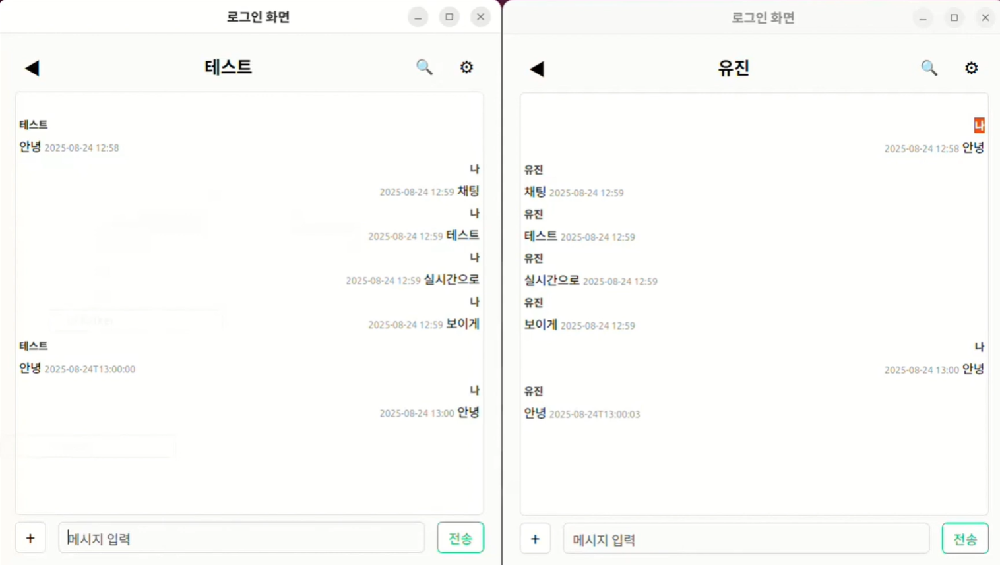

# Talker (Qt/C++ 1:1 메신저)

Qt/C++ 기반의 1:1 메신저 애플리케이션입니다. 친구 추가, 실시간 채팅, 상태메시지 변경, 파일(이미지/동영상) 전송(소용량) 기능을 제공합니다. MySQL에 사용자/친구/메시지를 저장하고, TCP/IP(JSON 라인 프로토콜)로 실시간 양방향 통신을 수행합니다.

---

## 개발 기간
- 2025.08.14(목) ~ 2025.08.22(금) [6일]

---

## 기술 스택
- OS: Windows 10/11, Ubuntu 22.04+
- Language/Lib: C++17, Qt 6 (Core/Widgets/Network/Sql)
- Build: CMake, Ninja/MSBuild
- DB: MySQL 8.0, MySQL Workbench
- IDE: Visual Studio 2022, Qt Creator

---

## 담당 / 팀 구성
- 1인 프로젝트 (개발/설계/문서)
- 역할: 클라이언트·서버·DB 스키마 설계 및 구현, 패키징

---

## 데모
- 이미지 



  

- 영상

 https://www.youtube.com/watch?v=R0uf1n25q0k&feature=youtu.be

---

## 실행 환경
- Qt 6.5+ (Windows: MSVC 2022 빌드, Ubuntu: gcc)
- MySQL Server 8.0+
- Windows: libmysql.dll(PATH)에 존재해야 QMYSQL 드라이버가 동작합니다.

---

## DB 준비(newchat.sql)
- MySQL Workbench
  1) 스키마 생성: talker
  2) File → Open SQL Script… → newchat.sql 열기 → 실행(번개)
- CLI 예시
```
mysql -u root -p
CREATE DATABASE IF NOT EXISTS talker CHARACTER SET utf8mb4 COLLATE utf8mb4_unicode_ci;
USE talker;
SOURCE "/absolute/path/to/newchat.sql";
```

---

## 환경변수
아래 환경변수를 서버/클라이언트 실행 환경에 설정하세요(시스템 변수 또는 CMakeSettings.json Environment).
- DB_HOST=127.0.0.1
- DB_NAME=talker
- DB_USER=본인 MySQL 사용자
- DB_PASS=본인 비밀번호
- CHAT_HOST=127.0.0.1
- CHAT_PORT=5555

참고: 새 콘솔/IDE에서 반영됩니다.

---

## 빌드/실행 (Windows · Visual Studio 2022)
### Server
1) VS2022 → File → Open → CMake… → Server/CMakeLists.txt
2) CMake 설정 시 Qt 경로가 필요하면:
   - CMake command arguments: -DCMAKE_PREFIX_PATH=C:\\Qt\\6.x.x\\msvc2022_64
3) Build(F7) → Run(F5)
   - 출력: ChatServer listening on 0.0.0.0 5555
   - 필요 시 인자: --host 0.0.0.0 --port 5555

### Client
1) VS2022 → File → Open → CMake… → Client/CMakeLists.txt
2) 동일하게 -DCMAKE_PREFIX_PATH 지정
3) Build(F7) → Run(F5)

---

## 빌드/실행 (Ubuntu · Qt Creator)
1) Qt Creator로 Server, Client 각 CMake 프로젝트 열기
2) Qt Kit 선택(Desktop Qt 6.x)
3) Build/Run

---

## 주요 기능
- 회원가입/로그인/ID·PW 찾기 (SHA-256 + Salt 해시 저장)
- 친구 검색/추가/삭제, 상태메시지 관리
- 1:1 채팅(실시간 송수신), 입장 알림, 최근 대화 목록
- 파일 전송(이미지/동영상 소용량, 5MB 이하): 즉시 미리보기(이미지) 또는 파일 링크 표시
- 서버: 다중 클라이언트 처리, 상태메시지 방송, DB 일관성 반영

---

## 동작 개요
1) 로그인 전: 로그인/회원가입/ID·PW 찾기
2) 로그인 후: 친구 목록/채팅/더보기 메뉴
3) 채팅방: 텍스트 메시지 송수신, 파일 전송(+ 버튼)
4) 서버: TCP(JSON 한 줄 단위, \n 구분), 메시지/상태/파일을 중계 및 DB 반영

---

## 메시지 프로토콜(요약)
- 클라이언트→서버
  - 텍스트: { "type":"chat", "room_id":5, "text":"안녕" }
  - 파일: { "type":"file", "room_id":5, "filename":"a.png", "mime":"image/png", "data":"<base64>" }
  - 상태 알림: { "type":"C2S_STATUS_NOTIFY", "status":"공부중" }
- 서버→클라이언트
  - 텍스트: { "type":"chat", "room_id":5, "sender":"alice", "text":"hi", "ts":"ISO-8601" }
  - 파일: { "type":"file", "room_id":5, "sender":"bob", "filename":"a.png", "mime":"image/png", "data":"<base64>", "ts":"ISO-8601" }
  - 푸시: { "type":"S2C_FRIEND_STATUS_CHANGED", "login_id":"alice", "status":"..." }

---

## 실행 팁
- QMYSQL 드라이버 오류 시: Qt MySQL 드라이버 설치, libmysql.dll PATH 확인(Windows)
- DB 연결 실패 시: 환경변수(DB_HOST/NAME/USER/PASS) 재확인, MySQL 권한 점검
- 채팅 연결 실패 시: 서버 실행 여부, 방화벽/포트(기본 5555), CHAT_HOST/CHAT_PORT 확인
